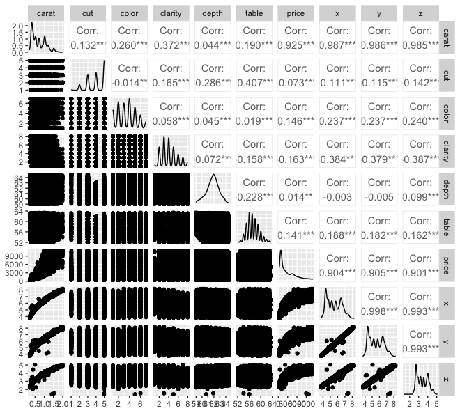

```{r setup, include=FALSE}
knitr::opts_chunk$set(echo = TRUE)
library(tidyverse)
library(rpart)
library(dplyr)
library(rpart.plot)
library(ISLR2)
library(plyr)
library(ggplot2)
library(GGally)
library(leaps)
library(randomForest)
library(Metrics)
library(caret)
library(leaps)
library(glmnet)
library(glmnetUtils)
library(pls) 
library(boot)
library(corrplot)
set.seed(2)
```

$\textbf{Objective}$ : Predict the Price of Diamond from the list of predictors, Decide the most important features of the diamonds that effect the price of the Diamond.\

$\textbf{Diamonds Dataset}$: 
```{r}
attach(diamonds)
diamonds
```
$\newline$
This dataset has 53,930 records.\
$\newline$
Price  $\hspace{2cm}$Price of the diamond in US dollars.\
Carat  $\hspace{1.9cm}$Weight of the diamond.\
Cut    $\hspace{2.2cm}$Quality of cut.\
Color  $\hspace{2cm}$Color of Diamond.\
Clarity $\hspace{1.8cm}$How Clear the diamond is.\
x$\hspace{2.8cm}$Length of the diamond in mm.\
y$\hspace{2.8cm}$Width of the diamond in mm.\
z$\hspace{2.8cm}$Depth of the diamond in mm.\
depth$\hspace{2cm}$Total depth percentage of the diamond.( depth percantage = z/mean(x,y))\
table$\hspace{2.1cm}$width of top to relatively widest point on the diamond.\

$\newline$
$\textbf{Predictors}$ :
```{r}
colnames(diamonds)
```
$\newline$
$\textbf{Numerical Columns}$ :
```{r}
num_cols <- select_if(diamonds, is.numeric)
colnames(num_cols)
```

Among the predictors Carat, x, y, z, depth and table are numerical columns.\
$\newline$
$\textbf{Categorical Columns}$ :
```{r}
cat_col <- select_if(diamonds, negate(is.numeric))
colnames(cat_col)
```
$\newline$
Among the predictors cut,color and clarity are categorical columns.\
$\textbf{Outlier Detection}$ :
For the Numerical Columns Outlier detection is done using box plots \
```{r}
par(mfrow=c(2,4))
for (i in colnames(num_cols)) {
  boxplot(diamonds[,i], main = i)
}
```
Outliers are found are for all the 6 numerical columns.\
$\newline$
$\textbf{Outliers Removal}$ :
Removed Outliers as they can be problematic because they can affect the results of an analysis.\
All the outliers are removed using boxplots out function.\
```{r}
# remove outliers ## trying to put into for loop, but this works for now
outliers.carat <- boxplot(diamonds$carat, plot=FALSE)$out
diamonds <- diamonds[-which(diamonds$carat %in% outliers.carat),]

outliers.depth <- boxplot(diamonds$depth, plot=FALSE)$out
diamonds <- diamonds[-which(diamonds$depth %in% outliers.depth),]

outliers.table <- boxplot(diamonds$table, plot=FALSE)$out
diamonds <- diamonds[-which(diamonds$table %in% outliers.table),]

outliers.price <- boxplot(diamonds$price, plot=FALSE)$out
diamonds <- diamonds[-which(diamonds$price %in% outliers.price),]

outliers.x <- boxplot(diamonds$x, plot=FALSE)$out
diamonds <- diamonds[-which(diamonds$x %in% outliers.x),]

outliers.y <- boxplot(diamonds$y, plot=FALSE)$out
diamonds <- diamonds[-which(diamonds$y %in% outliers.y),]

outliers.z <- boxplot(diamonds$z, plot=FALSE)$out
diamonds <- diamonds[-which(diamonds$z %in% outliers.z),]
```
After Outlier Removals Box Plots looks like this.\
```{r, echo=FALSE}
par(mfrow=c(2,4))
for (i in colnames(num_cols)) {
  boxplot(diamonds[,i], main = i)
}
```
$\newline$
After outliers removal 47000 records are remained.\
$\newline$
$\textbf{Pairwise Association}$ :
To find out the predictors that price of the diamond Pairwise association of the each predictor is done to see if any unwanted or least contributed columns can be dropped.\
```{r, eval = FALSE}
ggpairs(diamonds)
```

Numerical Correlations are plotted as pie charts for clear understanding.\
```{r}
cor_mat <- cor(diamonds[, -c(2:4)])
cor_mat
corrplot(cor_mat, method="pie", type="lower", addCoef.col = "black")
```
$\newline$
From Both the Plots it is visible that carat is highly correlated to x,y,z that has 99% correlation.\
$\newline$
$\textbf{Principle Component Analysis}$ :
$\newline$
To decide on the most important features Principal component Analysis is uses as it reduces dimensions.\
```{r}
diamonds$cut = as.numeric(unclass(diamonds$cut))
diamonds$clarity = as.numeric(unclass(diamonds$clarity))
diamonds$color = as.numeric(unclass(diamonds$color))
pr.out <- prcomp(diamonds %>% select (-price), scale = TRUE)

std_dev <- pr.out$sdev
pr_var <- std_dev^2
prop_varex <- pr_var/sum(pr_var)

plot(prop_varex, xlab = "Principal Components",
     ylab = "Proportion of Variance", type = "b")
```

From the scree plot it is visibile 6 components are atleast necessary to represent 98% variance in the data.\
Considering 6 predictors to represent most of the variance\
$\newline$
As x,y,z are highly correlated carat. xyz are dropped from the table\

```{r}
diamonds <- diamonds %>% 
  select (-x, -y, -z)
```
$\newline$
$\textbf{Data Encoding}$ :\
$\newline$
Encoded categorical variables to values for pca itself, using below code\
```{r, eval=FALSE}
diamonds$cut = as.numeric(unclass(diamonds$cut))
diamonds$clarity = as.numeric(unclass(diamonds$clarity))
diamonds$color = as.numeric(unclass(diamonds$color))
```
$\newline$
$\textbf{Data Split}$ :
$\newline$
split the data in train and test in 70:30 ration
```{r}
# split into 70% train and 30% test
partition = sample(nrow(diamonds), as.integer(nrow(diamonds)*0.7))
train_data <- diamonds[partition,]
test_data <- diamonds[-partition,]
```
$\newline$
$\textbf{Data Normalisation}$
For stability of the dat, normalisation is done.\
```{r}
# normalize/standardize the data
mean_vector = apply(train_data %>% select (-price), MARGIN=2, mean)
sd_vector = apply(train_data %>% select (-price), MARGIN=2, sd)

train_data[c(-7)] <- scale(train_data[c(-7)], center=mean_vector, scale=sd_vector)
test_data[c(-7)] <- scale(test_data[c(-7)], center=mean_vector, scale=sd_vector)

# Separate out predictors and response
train_X <- train_data %>%
  select(-price)
train_Y <- train_data$price
test_X <- test_data %>%
  select(-price)
test_Y <- test_data$price
```